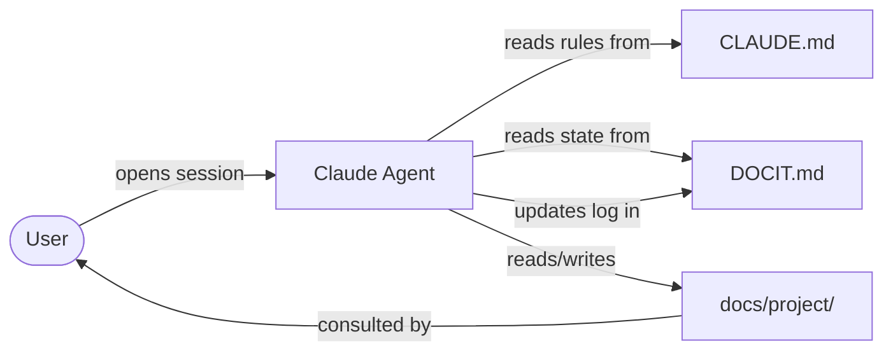
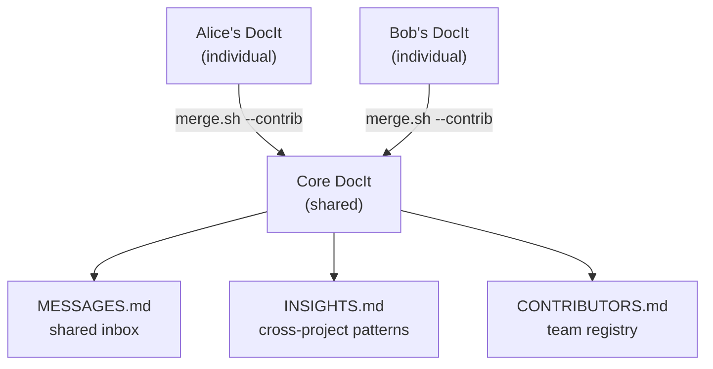

# DocIt

> A codebase explorer powered by markdown and an AI agent. No special software required.

<!-- explored: 2026-02-27 -->

## Overview

- **Language(s)**: Markdown, Bash
- **Type**: Documentation system / agent-driven knowledge tool
- **Size**: 5 files, ~4 key concepts
- **Entry points**: `docit.sh`, `CLAUDE.md` (agent entry), `DOCIT.md` (state entry)

## Directory Structure

```
DocIt/
├── CLAUDE.md           ← Agent operating instructions (+ Mermaid guidelines)
├── DOCIT.md            ← Living document: vision, state, exploration log
├── README.md           ← Human-facing introduction
├── docit.sh            ← Session helper: explore / status / sync / backup
│
├── backup.sh           ← Sync docs/ to a private git repo
├── restore.sh          ← Restore from backup
├── merge.sh            ← Remote sync or --contrib federation merge
├── cron.sh             ← Scheduled sync wrapper
├── setup.sh            ← Install cron/systemd automation
│
├── MESSAGES.md         ← Shared inbox (core DocIt)
├── INSIGHTS.md         ← Cross-codebase patterns ledger (core DocIt)
├── CONTRIBUTORS.md     ← Team contributor registry (core DocIt)
│
└── docs/               ← All generated codebase explorations
    └── docit/
        └── index.md    ← This file
```

## Architecture

DocIt is a three-layer system. The **instructions layer** (`CLAUDE.md`) is stable — it defines the rules the agent follows. The **state layer** (`DOCIT.md`) is fluid — it tracks what's known, what's not, and what's next. The **knowledge layer** (`docs/`) grows with every exploration.

No code runs at start-up. The system activates when a user opens a conversation with Claude, references `CLAUDE.md`, and asks about a codebase. The agent is the runtime.



The agent reads before it writes — existing docs are always loaded before new exploration begins, so each session builds on the last.

### Individual vs Core



Individual DocIts feed into a core via `merge.sh --contrib`. Conflicts are resolved by `claude -p`, which synthesises both sides rather than picking one.

## Key Concepts

- **Living documentation**: docs are augmented, not replaced, on each session
- **Acknowledged gaps**: `<!-- TODO: -->` markers are first-class — better to mark uncertainty than fake completeness
- **Dogfooding**: `docs/docit/` shows what DocIt output looks like, using DocIt itself as the subject
- **Pseudo software**: the markdown files are the program; the AI agent is the CPU

## Components

| Component | Path | Purpose |
|-----------|------|---------|
| [Agent Instructions](./agent-instructions.md) | `CLAUDE.md` | Rules, templates, Mermaid guidelines, core DocIt session protocol |
| [Living Document](./living-document.md) | `DOCIT.md` | System state, vision, exploration log |
| [Session Helper](./session-helper.md) | `docit.sh` | CLI: explore / status / sync / backup |

## Dependencies

- **Claude (AI agent)**: reads `CLAUDE.md` and does the exploration work; `claude -p` used by `merge.sh` for conflict resolution
- **Bash**: for all `.sh` scripts (requires bash 4+ for `mapfile`)
- **Git**: expected — DocIt repos are version-controlled; `merge.sh` and `backup.sh` assume a git remote
- **rsync**: used by `backup.sh` and `restore.sh`
- **Markdown viewer**: any viewer that renders Mermaid (GitHub, Obsidian, Typora, VS Code) — no special setup needed

## Open Questions

- Should each `docs/<project>/` have a `state.md` for per-project exploration tracking?
- At what corpus size does LanceDB indexing become worth the complexity?
- Should `docit.sh explore` open the conversation automatically via `claude` CLI?
- Should `MESSAGES.md` get an archiving convention once it grows large (e.g. yearly archive files)?

<!-- TODO: add docs/docit/agent-instructions.md deeper analysis -->
<!-- TODO: add docs/docit/living-document.md deeper analysis -->
<!-- TODO: document merge.sh --contrib flow end-to-end once first real merge is done -->
