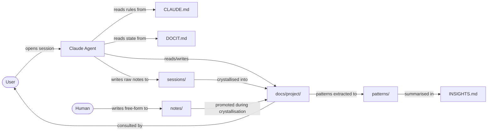
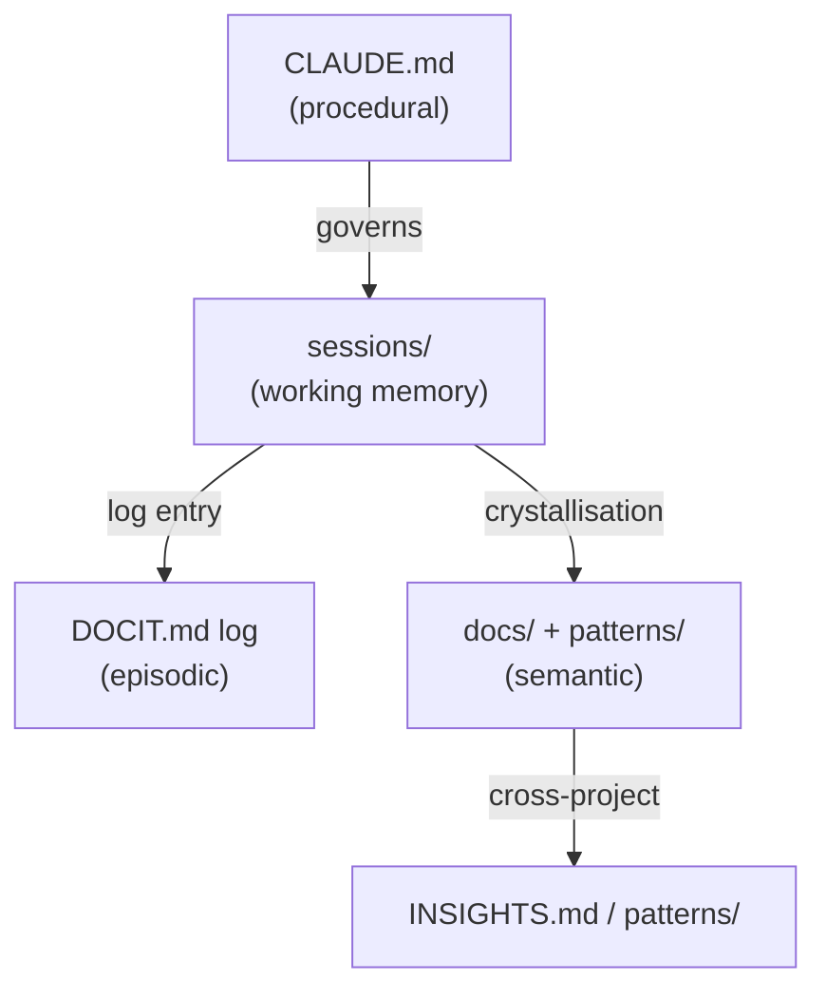
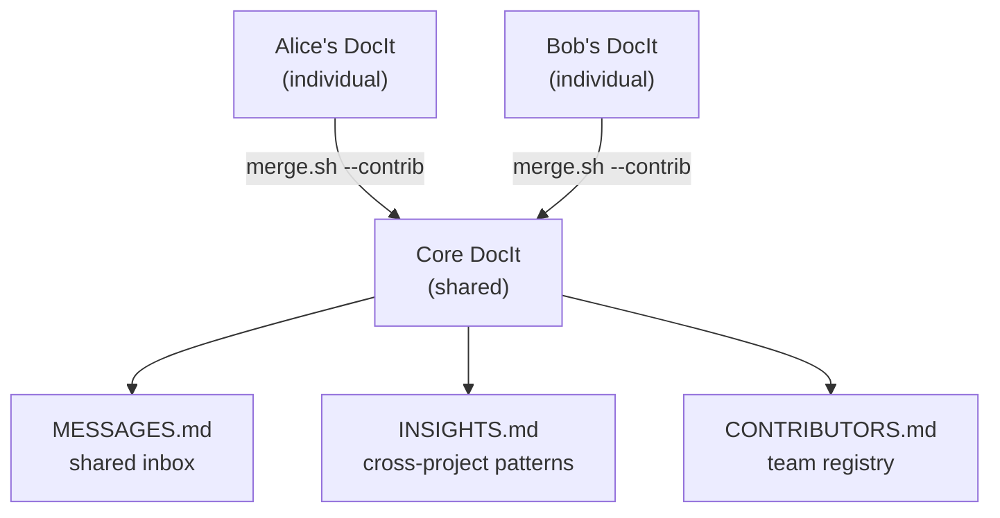

# DocIt

> A codebase explorer powered by markdown and an AI agent. No special software required.

<!-- explored: 2026-06-17 -->
<!-- entity: utility -->

## Overview

- **Language(s)**: Markdown, Bash
- **Type**: Documentation system / agent-driven knowledge tool
- **Size**: ~20 files, 4 knowledge tiers, 10 CLI commands
- **Entry points**: `docit.sh` (CLI), `CLAUDE.md` (agent), `DOCIT.md` (state)

## Directory Structure

```
DocIt/
├── CLAUDE.md               ← Agent instructions: templates, conventions, crystallisation
├── DOCIT.md                ← Living document: vision, state, exploration log
├── README.md               ← Human-facing introduction
├── docit.sh                ← Main CLI (10 commands)
├── llm.sh                  ← LLM backend abstraction (claude/ollama/llama-server)
│
├── backup.sh               ← Sync docs/ to a private git repo
├── restore.sh              ← Restore from backup
├── merge.sh                ← Remote sync or --contrib federation merge
├── cron.sh                 ← Scheduled sync wrapper
├── setup.sh                ← Install cron/systemd automation
│
├── .docit.conf.example     ← Config template
├── .gitignore
│
├── MESSAGES.md             ← Shared inbox (core DocIt)
├── INSIGHTS.md             ← Cross-codebase patterns ledger (core DocIt)
├── CONTRIBUTORS.md         ← Team contributor registry (core DocIt)
│
├── sessions/               ← Working memory tier (agent-written)
│   └── README.md           ← Session file format and lifecycle
│
├── notes/                  ← Human notes (free-form, no conventions)
│   └── README.md           ← What belongs here and how the agent uses it
│
├── patterns/               ← Cross-project pattern library
│   └── index.md            ← Pattern template and index
│
└── docs/                   ← All generated codebase explorations
    └── docit/              ← This directory (DocIt explores itself)
        ├── index.md
        ├── agent-instructions.md
        ├── living-document.md
        ├── session-helper.md
        └── sync-scripts.md
```

## Architecture

DocIt is a four-tier knowledge system. The **instructions tier** (`CLAUDE.md`) is stable — it defines the rules the agent follows. The **state tier** (`DOCIT.md`) tracks what's known. The **knowledge tiers** (`docs/`, `patterns/`, `sessions/`) hold progressively more durable understanding.

No code runs at start-up. The system activates when a user opens a conversation with Claude, references `CLAUDE.md`, and asks about a codebase. The agent is the runtime.



The agent reads before it writes — existing docs and session notes are loaded before exploration begins, so each session builds on the last.

### Knowledge Tiers



### Individual vs Core



## Key Concepts

- **Living documentation**: docs are augmented, not replaced, on each session
- **Crystallisation**: end-of-session step that flows working notes up to durable docs
- **Entity tagging**: `<!-- entity: -->` and `<!-- depends-on: -->` tags make docs machine-readable; `docit.sh graph` extracts them as a Mermaid dependency graph
- **Three operations**: ingest (explore), query (ask), lint (health-check) — every session is one of these
- **Friction preservation**: `> **Tension**:` marks genuine conflicts and unresolved trade-offs; `> **Inferred**:` marks uncertainty. Neither is smoothed over — consensus docs hide the decisions that matter
- **Human notes**: `notes/<project>/` is free-form human capture — no conventions. The agent reads and promotes these during crystallisation into `## Human Context` sections in component docs. `> **Context**:` marks human-added domain knowledge inline.
- **Source traceability**: PDFs and methodology specs ingested as `<!-- entity: source -->` docs; code components link back with `<!-- satisfies: source#section -->`; coverage gaps are explicitly tracked
- **Acknowledged gaps**: `<!-- TODO: -->` markers are first-class — better to mark uncertainty than fake completeness
- **Format portability**: DocIt docs are plain markdown with standard links and lightweight metadata tags — any agent that can read markdown can consume them. The value is in the content model, not the runtime. This is independently validated by Google's Open Knowledge Format (OKF), MemPalace, and Karpathy's original LLM-wiki pattern.
- **Pseudo software**: the markdown files are the program; the AI agent is the CPU

## Components

| Component | Path | Purpose |
|-----------|------|---------|
| [Agent Instructions](./agent-instructions.md) | `CLAUDE.md` | Rules, templates, entity tagging, crystallisation protocol |
| [Living Document](./living-document.md) | `DOCIT.md` | System state, vision, exploration log |
| [Session Helper](./session-helper.md) | `docit.sh` + `llm.sh` | CLI and LLM backend abstraction |
| [Sync Scripts](./sync-scripts.md) | `backup.sh`, `restore.sh`, `merge.sh`, `cron.sh`, `setup.sh` | Persistence, multi-device sync, team federation |

## Dependencies

- **Claude (AI agent)**: reads `CLAUDE.md` and does the exploration work; `claude -p` used by `merge.sh` and `llm.sh` for inference
- **Bash 4+**: for all `.sh` scripts (`mapfile`, `declare -a`); macOS ships with bash 3 — use `brew install bash`
- **Git**: expected — `merge.sh` and `backup.sh` assume a git remote
- **rsync**: used by `backup.sh` and `restore.sh`
- **jq**: used by `llm.sh` for ollama and llama-server JSON payloads
- **curl**: used by `llm.sh` for ollama and llama-server API calls
- **Markdown viewer**: any viewer that renders Mermaid (GitHub, Obsidian, Typora, VS Code) — no special setup needed

## Open Questions

- At what corpus size does LanceDB indexing become worth the complexity?
- Should `MESSAGES.md` get an archiving convention once it grows large?
- Should the `graph` command also traverse `patterns/` to show cross-project links?

<!-- TODO: document merge.sh --contrib flow end-to-end once first real merge is done -->
<!-- TODO: add a worked example of a full session → crystallisation cycle -->
