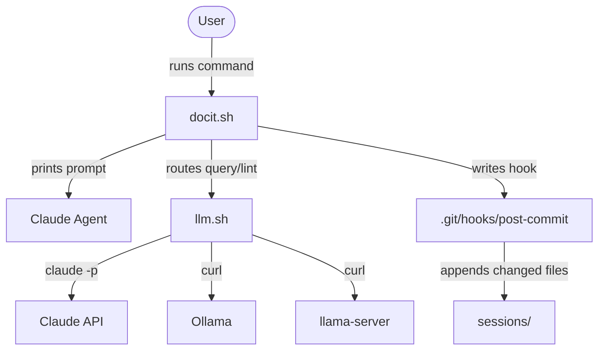

# Session Helper

**Path**: `docit.sh`, `llm.sh`
**Purpose**: CLI for all DocIt operations and LLM backend abstraction layer.

<!-- explored: 2026-04-08 -->
<!-- entity: utility -->
<!-- depends-on: living-document -->

## What It Does

`docit.sh` is the main CLI for DocIt. It handles ten commands spanning the full workflow: first-time setup, exploration prompts, querying docs, linting, dependency graphs, session management, git hook installation, and backup/sync.

`llm.sh` is a backend abstraction — it routes LLM calls to Claude (`claude -p`), Ollama, or llama-server based on the `DOCIT_LLM` config variable. The `query`, `lint --deep`, and `merge.sh` conflict resolution all go through it.

Neither script does exploration work directly. `docit.sh` prints prompts or calls `llm.sh`. The agent is the runtime.

## Key Files

| File | Role |
|------|------|
| `docit.sh` | Main CLI — ~550 lines of bash; all ten commands |
| `llm.sh` | LLM backend router — claude / ollama / llama-server |
| `.docit.conf` | Runtime config (gitignored); copy from `.docit.conf.example` |

## Commands

### `./docit.sh init`

Interactive first-time setup wizard. Prompts for:
- LLM backend (claude / ollama / llama-server)
- Model name and API URL (for ollama/llama-server)
- Backup directory (optional)
- Auto-sync interval

Writes `.docit.conf`. Safe to re-run — prompts to overwrite each setting.

### `./docit.sh ingest <path>` (alias: `explore`)

Prints a ready-to-paste Claude prompt for exploring a codebase. Resolves the path to an absolute path, determines the project name, and checks whether `docs/<project>/index.md` already exists (augment vs first-time). The printed prompt includes the target path, docs output location, and instructions for the agent.

### `./docit.sh update <project> [files...]`

Prints a re-exploration prompt scoped to specific changed files. Used after commits — either manually or via the post-commit hook. The agent reads existing docs, re-examines only the listed files, patches affected sections, and runs crystallisation.

### `./docit.sh query "<question>" [--project <name>] [--save]`

Sends a question to `llm.sh` with the relevant project docs as context. If `--project` is given, only that project's docs are loaded. Otherwise all docs are searched. `--save` appends the Q&A to `sessions/YYYY-MM-DD-query.md` for later crystallisation.

### `./docit.sh lint <project> [--deep]`

Structural lint (always runs):
- Checks that `index.md` and at least one component doc exist
- Verifies `<!-- explored: -->` dates are present
- Warns if any doc hasn't been updated in 90+ days

`--deep` additionally calls `llm.sh` with all project docs and asks for contradictions, inconsistencies, stale claims, and gaps. Returns a structured report.

### `./docit.sh graph <project>`

Extracts `<!-- entity: type -->` and `<!-- depends-on: a,b -->` tags from all `docs/<project>/*.md` files and emits a Mermaid `graph LR` to stdout. Node shapes are determined by entity type:

| Entity type | Mermaid shape |
|-------------|---------------|
| service | stadium `[[name]]` |
| model | cylinder `[(name)]` |
| interface | rhombus `{name}` |
| module / utility / pattern | rectangle `[name]` |

Pipe to a file and open in any Mermaid-capable viewer: `./docit.sh graph myapp > arch.md`.

### `./docit.sh install-hook <repo-path>`

Writes a post-commit hook to `<repo>/.git/hooks/post-commit`. After every commit to that repo, the hook appends the list of changed files to `sessions/YYYY-MM-DD-<project>-pending.md`. Run `./docit.sh update <project>` to turn the session file into a re-exploration prompt.

### `./docit.sh status`

Scans `docs/` for `index.md` files and prints a table: project name, doc file count, last explored date (from `<!-- explored: -->` tag in `index.md`).

### `./docit.sh sync`

Pulls from the configured remote (calls `merge.sh` in non-contrib mode). Run manually or via cron.

### `./docit.sh backup`

Calls `backup.sh` — rsyncs `docs/`, `DOCIT.md`, and federation files to `DOCIT_BACKUP_DIR`, commits, and pushes.

## How It Works

`docit.sh` sources `.docit.conf` at startup. All functions are prefixed `cmd_` for the main commands and `_` for internal helpers. The entry point is a `case` statement on `$1`.

`llm.sh` accepts `--system "prompt"` for the system prompt and the user message as a positional arg or stdin. It checks backend availability before calling and exits non-zero if the backend is unreachable.

## Interfaces

**Input**: command-line arguments + `.docit.conf`

**Output**:
- `ingest`, `update`: formatted prompt string to stdout (paste into Claude)
- `query`, `lint --deep`: LLM response to stdout
- `lint` (structural): pass/warn/fail report to stdout
- `graph`: Mermaid block to stdout
- `status`: summary table to stdout
- `init`, `install-hook`, `sync`, `backup`: side effects (files written, git operations)

## Dependencies

- **bash 4+**: `mapfile`, `declare -a` — macOS ships with bash 3; use `brew install bash`
- **curl**: used by `llm.sh` for ollama and llama-server API calls
- **jq**: used by `llm.sh` to build JSON payloads for ollama and llama-server
- **git**: assumed by `install-hook`, `sync`, `backup`
- **rsync**: used by `backup.sh` (called from `./docit.sh backup`)
- **claude CLI**: used by `llm.sh` when `DOCIT_LLM=claude` (the default)

## Notes & Gotchas

The `ingest` command deliberately prints a prompt rather than opening a conversation automatically. This keeps `docit.sh` dependency-free — it works even if `claude` CLI is not installed. If you want auto-open, pipe the output: `./docit.sh ingest ~/myapp | claude`.

The `graph` command reads HTML comment tags — if a component doc is missing `<!-- entity: -->`, that component is silently skipped. Run `./docit.sh lint --deep` to catch missing tags.

`llm.sh` uses `claude -p` (non-interactive, pipe mode). This is not a conversation — each call is stateless. For `query`, the entire project doc set is sent as context in a single call.

The post-commit hook writes to `sessions/YYYY-MM-DD-<project>-pending.md` — if that file grows stale (no follow-up `update` run), the crystallisation step has to reconcile it against newer docs. The `status` command does not surface pending session files; run `ls sessions/` to see them.

## Open Questions

- Should `./docit.sh graph` traverse `patterns/` in addition to `docs/<project>/` to show cross-project links?
- Should `query --save` auto-detect the project from context rather than requiring `--project`?
- Should `lint` warn on session files older than N days that haven't been crystallised?
